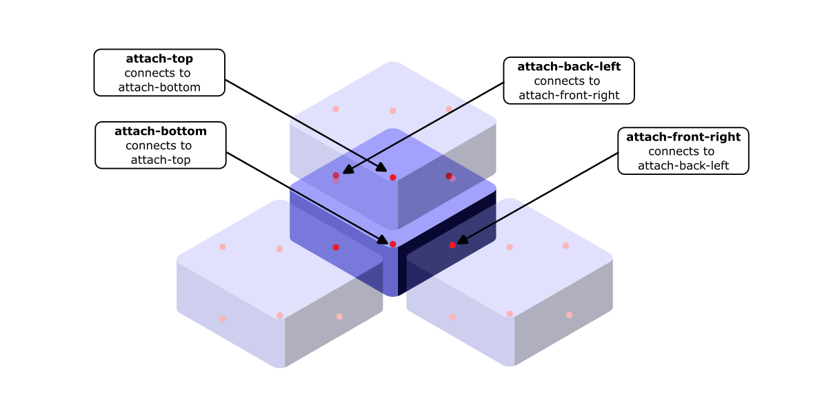
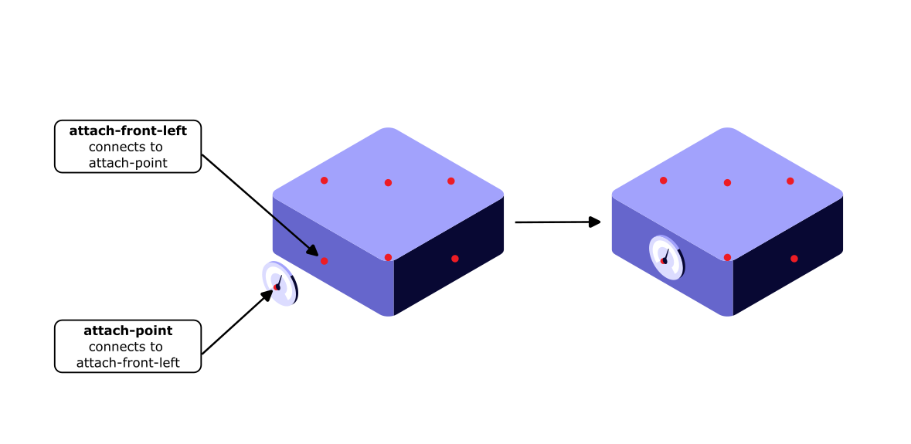
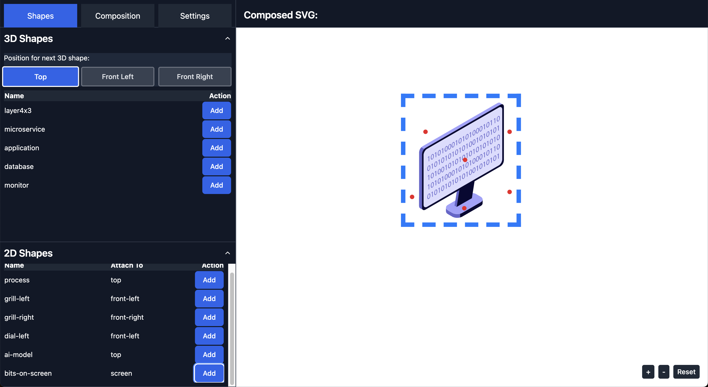

# SVG Isometric Shapes Compiler

## Description

The SVG Isometric Shapes Compiler is a powerful web application that allows users to create complex isometric diagrams by combining 3D and 2D SVG shapes. This tool is perfect for designers, architects, and anyone who needs to create detailed isometric illustrations for presentations, documentation, or visual aids.

[Try the demo online](https://bijoor.github.io/isometric-compiler-ui/)

## Features

- Drag-and-drop interface for easy shape placement
- Library of pre-defined 3D and 2D SVG shapes
- Ability to combine shapes to create complex isometric diagrams
- Google Drive integration for loading custom shape libraries
- Save and load diagram compositions
- Export diagrams as SVG files
- Customizable canvas size
- Zoom and pan functionality for detailed editing

### Using the Application


The application interface is divided into three main sections:

1. **Left Panel**: Contains tabs for Shapes, Composition, and Settings.
2. **Main Canvas**: Displays the current diagram composition.
3. **Top Bar**: Provides options for saving, loading, and exporting diagrams.

#### Steps to Create a Diagram:

1. Load your shape library using the Settings tab.
2. Switch to the Shapes tab and add 3D shapes to your canvas.
3. Select a 3D shape and add 2D shapes to its faces as desired.
4. Use the Composition tab to adjust the positioning and layering of shapes.
5. Fine-tune your diagram using the zoom and pan controls on the canvas.
6. Save your work or export the final SVG using the options in the Settings tab.


## Outcomes

Users can achieve the following outcomes:

- Create complex isometric diagrams for architectural layouts, network diagrams, or infographics.
- Design custom shape libraries for specific project needs.
- Collaborate on diagram designs by sharing composition files.
- Export high-quality SVG diagrams for use in presentations or publications.

## Settings Panel


The Settings panel allows you to configure various aspects of your diagram and the application. Here's a breakdown of the options:

### Canvas Size
- **Width**: Set the width of your canvas in pixels. Default is 1000.
- **Height**: Set the height of your canvas in pixels. Default is 1000.

### Diagram Settings
- **File Name**: Enter the name for your SVG file when saving or downloading. In the example, it's set to "bricks.svg".
- **Folder Path**: Specify the folder path where diagrams will be saved and loaded from. In this case, it's set to "My Diagrams".
- **Clip SVG to contents**: When checked, this option will trim the SVG to the content's boundaries, removing any excess blank space.

### Diagram Actions
- **Save Diagram**: Click to save your current diagram composition.
- **Load Diagram**: Click to load a previously saved diagram.
- **Download SVG**: Click to download your diagram as an SVG file.

### Shapes Library Settings
- **Spreadsheet URL**: Enter the URL of the Google Sheets document containing your shapes library index.
- **Folder URL**: Enter the URL of the Google Drive folder containing your SVG shape files.
- **Load Shapes from Google Drive**: Click this button to load your custom shape library from the specified Google Drive locations.

The Settings panel provides crucial functionality for managing your diagrams and customizing the application to suit your needs. It allows you to control the canvas size, manage file operations, and set up your custom shape library, making it an essential part of the SVG Isometric Shapes Compiler workflow.

## Creating Shapes for the Library

### 3D Shapes

3D shapes form the base structure of your isometric diagrams.

#### Creating a 3D Shape

1. Design your shape in an SVG editor (e.g., Inkscape, Adobe Illustrator).
2. Add basic attachment points for each face where other 3D shapes can connect:
   - Use the format: `id="attach-[position]"`
   - Standard positions: `top`, `front-left`, `front-right`, `side-left`, `side-right`
   - Example: `<circle id="attach-top" cx="50" cy="50" r="2" />`
3. Add optional named attachment points for more specific connections:
   - Format: `id="attach-[position]-[name]"`
   - Example: `<circle id="attach-top-center" cx="50" cy="50" r="2" />`
4. Add special attachment points for 2D shapes:
   - Format: `id="attach-[name]"`
   - Example: `<circle id="attach-screen" cx="100" cy="75" r="2" />`



### 2D Shapes

2D shapes are flat designs that can be attached to 3D shapes to add details or decorations.

#### Creating a 2D Shape

1. Design your 2D shape in an SVG editor.
2. Add a single attachment point:
   - Use `id="attach-point"` for the 2D shape's attachment point.
   - Example: `<circle id="attach-point" cx="0" cy="0" r="2" />`
3. Design the shape considering the perspective and shear for the face it will attach to (top, front-left, or front-right).



### Using Attachment Points in Composition

1. For 3D shapes:
   - The application uses the attachment points to determine valid positions for other 3D shapes.
   - You can select which attachment point to use when adding a new 3D shape to your composition.

2. For 2D shapes:
   - 2D shapes can only be attached to specified positions on 3D shapes.
   - The application aligns the 2D shape's `attach-point` with the selected attachment point on the 3D shape.
   - 2D shapes can use optional named attachment points if available on the specified position.
   - Special attachment points (e.g., `attach-screen`) can be used for specific 2D shape placements.



## Creating the Shape Library Index

To make your shapes available in the application, you need to create an index spreadsheet.

### Spreadsheet Structure

Create a Google Sheets document with the following columns:

1. `name`: A unique identifier for the shape
2. `svgFile`: The filename of the SVG file (must match the file in your Google Drive folder)
3. `type`: Either "3D" or "2D"
4. `attachTo`: For 2D shapes, specify where it can attach ("top", "front-left", "front-right", or a special attachment point like "screen")

### Example Index Spreadsheet

| name          | svgFile           | type | attachTo    |
|---------------|-------------------|------|-------------|
| microservice  | microservice.svg  | 3D   |             |
| monitor       | monitor.svg       | 3D   |             |
| process       | process.svg       | 2D   | top         |
| grill-left    | grill-left.svg    | 2D   | front-left  |
| bits-on-screen| bits-on-screen.svg| 2D   | screen      |

### Best Practices

1. Consistency: Keep your attachment points and naming conventions consistent across shapes.
2. Testing: Test your shapes in the application to ensure they behave as expected in compositions.
3. Optimization: Ensure your SVG files are optimized and don't contain unnecessary elements or layers.
4. Documentation: Consider adding comments in your SVG files to document special attachment points.

By following these guidelines, you can create a rich library of 3D and 2D shapes that can be combined to create complex and detailed isometric diagrams with precise control over shape placement and connections.

## Contributing

We welcome contributions to improve the SVG Isometric Shapes Compiler! Here's how you can contribute:

1. Fork the repository on GitHub.
2. Clone your forked repository to your local machine.
3. Create a new branch for your feature or bug fix.
4. Make your changes and commit them with clear, descriptive messages.
5. Push your changes to your fork on GitHub.
6. Create a pull request from your fork to the main repository.

## Code Structure

The project structure is as follows:

```
.
├── src/
│   ├── components/
│   │   └── ui/
│   │       ├── Accordion.tsx
│   │       ├── Button.tsx
│   │       ├── Checkbox.tsx
│   │       ├── Dialog.tsx
│   │       ├── Input.tsx
│   │       ├── Select.tsx
│   │       └── ToggleGroup.tsx
│   ├── lib/
│   │   ├── diagramComponentsLib.ts
│   │   ├── googleDriveLib.ts
│   │   ├── svgUtils.ts
│   │   └── utils.ts
│   ├── panels/
│   │   ├── CompositionPanel.tsx
│   │   ├── SettingsPanel.tsx
│   │   └── ShapesPanel.tsx
│   ├── App.tsx
│   ├── App.css
│   ├── ImprovedLayout.tsx
│   ├── SVGDisplay.tsx
│   ├── DiagramComponentsDisplay.tsx
│   ├── Types.ts
│   ├── config.ts
│   ├── index.css
│   ├── main.tsx
│   └── vite-env.d.ts
├── public/
├── dist/
├── index.html
└── various configuration files
```

Key files and their roles:

- `src/App.tsx`: The main application component that manages the overall state and composition of the application.
- `src/ImprovedLayout.tsx`: Defines the layout of the application, including the panel structure and SVG display area.
- `src/SVGDisplay.tsx`: Handles the rendering and interaction with the SVG canvas where the isometric diagram is displayed.
- `src/DiagramComponentsDisplay.tsx`: Displays the current components in the diagram.
- `src/Types.ts`: Contains TypeScript type definitions used throughout the application.
- `src/config.ts`: Holds configuration settings for the application.

- `src/components/ui/`: Contains reusable UI components like buttons, dialogs, and form elements.

- `src/lib/`:
  - `diagramComponentsLib.ts`: Contains functions for manipulating diagram components.
  - `googleDriveLib.ts`: Handles integration with Google Drive API for loading and saving diagrams.
  - `svgUtils.ts`: Utility functions for SVG manipulation and processing.
  - `utils.ts`: General utility functions used across the application.

- `src/panels/`:
  - `CompositionPanel.tsx`: Manages the composition of 3D and 2D shapes in the diagram.
  - `SettingsPanel.tsx`: Handles application settings and diagram export options.
  - `ShapesPanel.tsx`: Displays available shapes and allows adding them to the diagram.

- `index.html`: The main HTML file that serves as the entry point for the application.
- `vite.config.ts`, `tsconfig.json`, etc.: Configuration files for the build process and TypeScript compilation.

This structure follows a modular approach, separating concerns into different components and utility files. The `src/components/ui/` directory contains reusable UI components, while `src/panels/` contains the main functional areas of the application. The `src/lib/` directory houses utility functions and core logic for diagram manipulation and integration with external services.

### Development Workflow

1. Choose an issue to work on or create a new one for your proposed feature/fix.
2. Create a new branch for your work.
3. Develop and test your changes locally.
4. Ensure your code follows the project's coding standards and practices.
5. Update documentation as necessary.
6. Create a pull request with a clear description of your changes.

## Acknowledgements

This project was made possible through the innovation engineering expertise provided by Accion Labs. Their commitment to pushing the boundaries of technology and fostering creative solutions has been instrumental in the development of the SVG Isometric Shapes Compiler.

We extend our sincere gratitude to the team at Accion Labs for their support, guidance, and contributions to this project.